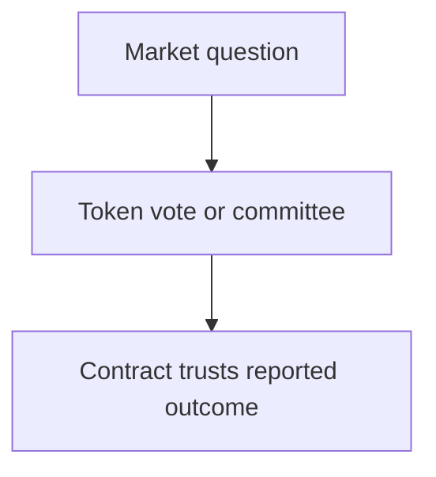
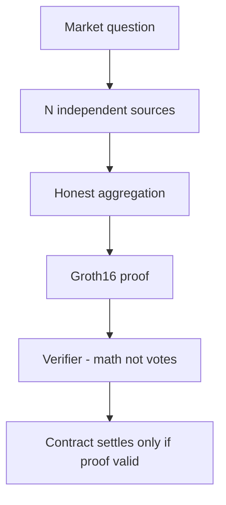
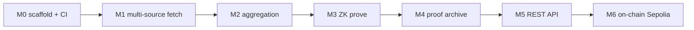

# Why this project exists

Prediction market contracts cannot see the real world. They depend on an **oracle** to report outcomes. When that report is wrong, funds settle to the wrong side.

## Traditional oracle (governance trust)

A concentrated voter or compromised committee can report a false result. The contract has no way to verify multi-source agreement or honest computation.

## ZK oracle aggregator (cryptographic verification)

This system fetches from many sources, aggregates with outlier removal and weighted consensus, and produces a **short proof** that the computation was run correctly. Anyone can verify the proof; invalid proofs are rejected.

## Comparison

| | Traditional oracle | ZK oracle aggregator |
| --- | --- | --- |
| Trust basis | Governance, votes | Math + multi-source consensus |
| Dispute | Slow human process | `disputed` flag, no proof issued |
| Audit | Opaque logs | Public proofs + source hashes |
| On-chain | Often none | Groth16 verify on-chain (phase B) |

## Milestone progress

**Current:** M0–M1 (fetcher, health API, CI). M2–M6 planned.
