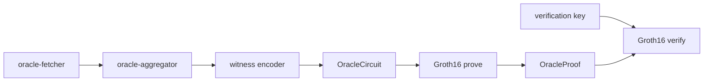

# M3 — ZK circuit, prover, and verifier

## Prerequisite

**Phase 1 (Security & CI hardening) must be complete** before starting M3. See [security_ci.plan.md](security_ci.plan.md) and [docs/security/](../security/).

---

## Where you are now

| Milestone | Status |
|-----------|--------|
| M0 workspace, CI, docker, migrations | Done |
| M1 fetcher + tests | Done |
| M2 aggregation + CLI | Done |
| **M3 ZK prove/verify** | **This plan** |
| M4 Postgres archive | Planned |
| M5 `/resolve` API | Planned |
| M6 Solidity / Sepolia | Planned |

Repo: `/home/joshi/storage/zk-oracle-aggregator`. MSRV **1.85**. Aggregator: `crates/oracle-core/src/aggregator/mod.rs`. Prover/verifier bins are stubs.



---

## Goal

Produce a **128-byte Groth16 proof** (BN254) that certifies:

1. Each source outcome in the witness is binary (0/1).
2. The weighted outcome matches the public `final_outcome`.
3. Public `source_count` matches active sources (min 3 when not disputed).
4. Public `agreement_hash` commits to the active source `raw_hash` set.

Off-chain M2 `aggregate()` still runs the real pipeline; the circuit proves the witness is **consistent** with public outputs.

---

## Design choices

| Topic | Decision |
|-------|----------|
| Location | `oracle-core` modules: `circuit/`, `witness/`, `prover/` |
| Stack | `ark-groth16`, `ark-bn254`, `ark-r1cs-std` **0.4.x** |
| Setup | Local `Groth16::circuit_specific_setup` → `keys/pk.bin`, `keys/vk.bin` (gitignored) |
| Circuit width | `MAX_SOURCES = 16`, zero-padded inactive slots |
| Weights | Fixed-point `u64` (`confidence × 1_000_000`), never `f64` in circuit |
| Outliers | Off-chain only in witness encoder validation |
| Hash | Off-chain BLAKE3 over sorted `raw_hash` → public `agreement_hash` |

---

## Step 0 — Before every commit

```bash
source /home/joshi/storage/bashrc-storage.sh
export GIT_CONFIG_GLOBAL=/home/joshi/storage/git-config/config
```

---

## Step 1 — Dependencies

Add arkworks 0.4 + `hex` to workspace `Cargo.toml` and `crates/oracle-core/Cargo.toml`. Gitignore `keys/`. Update `deny.toml` if needed.

---

## Step 2 — Circuit (`circuit/mod.rs`)

| Step | Proves |
|------|--------|
| **3a** | Each outcome ∈ {0,1} |
| **3b** | Weighted sum vs `final_outcome` |
| **3c** | `source_count` ≥ 3 when not disputed |
| **3d** | `agreement_hash` over sorted `raw_hash`es |

---

## Step 3 — Witness encoder (`witness/mod.rs`)

`build_witness(responses, agg)` — validate against M2 `aggregate()`, reject disputed, pad to 16 slots.

---

## Step 4 — Prover (`prover/mod.rs`)

`OracleProof`, `setup` / `load` / `prove` / `verify` with `ark-serialize`.

---

## Step 5 — Binaries

- `oracle-prover setup --out keys/`
- `oracle-prover prove --keys keys/` (stdin JSON)
- `oracle-verifier --keys keys/vk.bin` (stdin proof JSON)

---

## Step 6 — Tests

Circuit satisfaction, witness/aggregator match, disputed rejection, agreement_hash determinism, Groth16 roundtrip, tampered proof rejection. Keep 7 existing tests green.

---

## Step 7 — Docs

Update `docs/ARCHITECTURE.md`, `docs/WHY.md`, `README.md` for M3.

---

## Step 8 — Local verification

```bash
cargo fmt --all --check
cargo clippy --workspace --all-targets -- -Dwarnings
cargo test --workspace
taplo fmt --check && typos
```

---

## Out of scope

M4 storage, M5 API, M6 chain, Powers of Tau, in-circuit outlier removal.

---

## Related plans

- Master: `~/.cursor/plans/zk_oracle_aggregator_8f6c0981.plan.md`
- M2 (done): `~/.cursor/plans/next_m2_aggregator_1819a5e5.plan.md`
- Guide: `~/storage/Downloads/zk_oracle_aggregator_guide.md` §5
