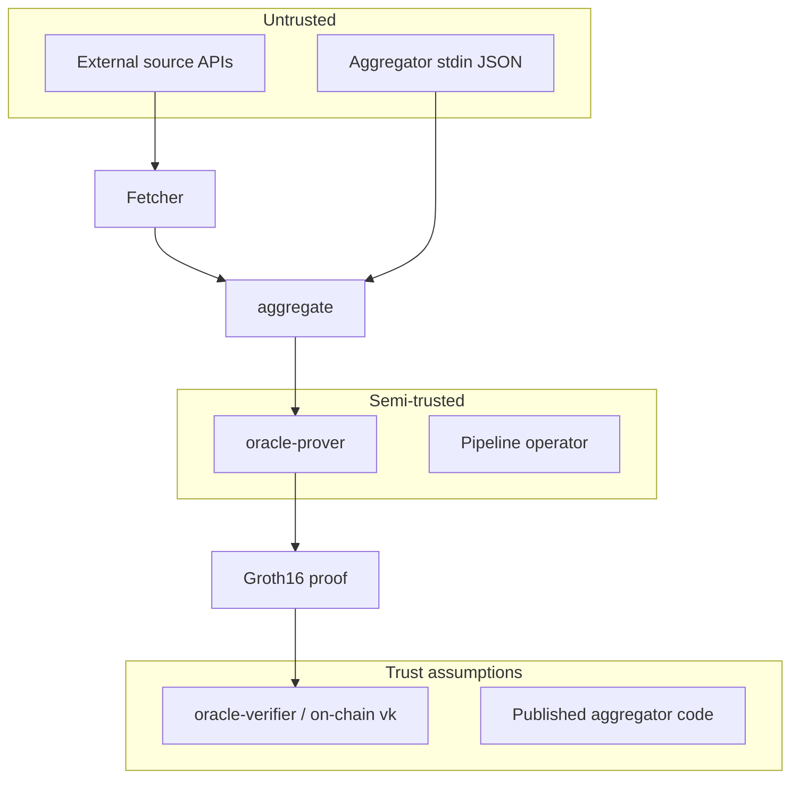

# Threat model

Adapted from [pashov/skills x-ray](https://github.com/pashov/skills/tree/main/x-ray) for this Rust oracle pipeline (M0–M2 implemented, M3 planned).

## System overview

## Actors

| Actor | Capability | Goal |
| --- | --- | --- |
| **Honest operator** | Runs fetcher, aggregator, prover | Correct market resolution |
| **Malicious source** | Returns biased JSON / wrong outcome | Skew aggregation |
| **Malicious prover** (M3) | Chooses arbitrary private witnesses | Forge proof for wrong outcome |
| **API caller** | Hits `oracle-server` endpoints | DoS, probe internals |
| **On-chain user** (M6) | Submits proof to contract | Settle market in their favor |

## Trust boundaries

1. **Fetcher → core:** Bodies are untrusted. Parsing and confidence bounds are the gate (F1–F3).
2. **CLI stdin → aggregator:** JSON is untrusted. Serde + aggregation invariants must hold without panic.
3. **Aggregator → prover (M3):** Aggregation result is the semantic truth; circuit must prove witness consistency.
4. **Verifier:** Only trusts vk + public inputs + proof bytes — not the prover.

## Attack surfaces

| Surface | Risk | Mitigation (current / planned) |
| --- | --- | --- |
| HTTP response injection | Wrong outcome in JSON | Parse validation; BLAKE3 audit trail |
| Outlier minority source | Skew if threshold wrong | `remove_outliers` at 0.70; disputed flag |
| Empty / single source | Weak consensus | `disputed` when agreement &lt; 0.60 |
| Stdin panic on bad JSON | DoS on CLI | `anyhow::Context` errors (no panic) |
| Non-binary witness (M3) | Fake majority | Z1 boolean constraints |
| Witness substitution (M3) | Hide source data | Z5 Poseidon commitments |
| Tampered proof (M3) | Accept invalid proof | Z7/Z8 Groth16 verify |
| Leaked proving key | Forge arbitrary proofs | G4 gitignore + CI secrets grep |
| Dependency compromise | Supply chain | `cargo audit`, `cargo deny` in CI |

## Composability (future)

| Integration | Note |
| --- | --- |
| PostgreSQL archive (M4) | Store proofs and source hashes; integrity via DB access control |
| REST `/resolve` (M5) | Authenticate operators; rate limit |
| Solidity verifier (M6) | Public input encoding must match off-chain verifier exactly |

## x-ray summary (Rust codebase)

| Metric | Value |
| --- | --- |
| Core modules | `fetcher`, `aggregator` |
| Binaries | 6 workspace bins |
| Unit tests | 7 in `oracle-core` |
| External I/O | HTTP (reqwest), stdin JSON |
| Crypto today | BLAKE3 only |
| Crypto planned | Groth16 BN254, Poseidon |

See [adversarial-vectors.md](adversarial-vectors.md) for test mapping and [audit-findings.md](audit-findings.md) for the Phase 1 baseline review.
