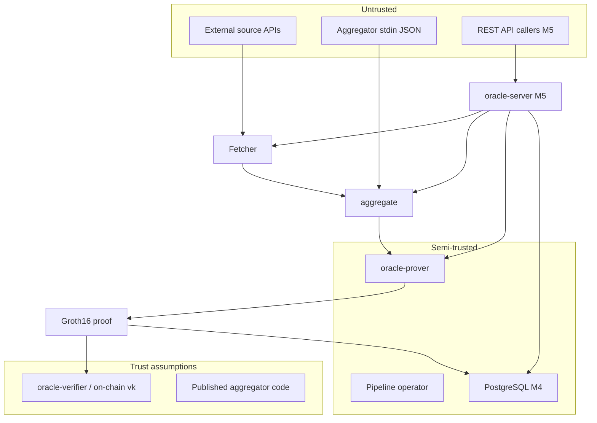

# Threat model

Threat model for the Rust oracle pipeline (M0–M3 implemented, M4–M7 planned).

## System overview

```mermaid
flowchart TB
  subgraph untrusted [Untrusted]
    APIs[External source APIs]
    StdinAgg[Aggregator stdin JSON]
    ApiCaller[REST API callers M5]
  end
  subgraph semi [Semi-trusted]
    Prover[oracle-prover]
    Operator[Pipeline operator]
    Postgres[PostgreSQL M4]
  end
  subgraph trusted [Trust assumptions]
    Verifier[oracle-verifier / on-chain vk]
    AggregatorLogic[Published aggregator code]
  end
  APIs --> Fetcher
  Fetcher --> Agg[aggregate]
  StdinAgg --> Agg
  Agg --> Prover
  Prover --> Proof[Groth16 proof]
  Proof --> Verifier
  Proof --> Postgres
  ApiCaller --> Server[oracle-server M5]
  Server --> Fetcher
  Server --> Agg
  Server --> Prover
  Server --> Postgres
```

## Actors

| Actor | Capability | Goal |
| --- | --- | --- |
| **Honest operator** | Runs fetcher, aggregator, prover | Correct market resolution |
| **Malicious source** | Returns biased JSON / wrong outcome | Skew aggregation |
| **Malicious prover** (M3) | Chooses arbitrary private witnesses | Forge proof for wrong outcome |
| **API caller** (M5) | Hits `oracle-server` endpoints | DoS, probe internals, trigger bogus resolves |
| **Database attacker** (M4) | SQL injection or credential theft | Tamper proof archive or reputation |
| **On-chain user** (M6) | Submits proof to contract | Settle market in their favor |

## Trust boundaries

1. **Fetcher → core:** Bodies are untrusted. Parsing and confidence bounds are the gate (F1–F3).
2. **CLI stdin → aggregator:** JSON is untrusted. Bounded read + serde + aggregation invariants must hold without panic.
3. **Aggregator → prover (M3):** Aggregation result is the semantic truth; circuit must prove witness consistency (Z6).
4. **Prover → storage (M4):** `OracleStore` writes proof bytes and `PublicInputs` JSON via parameterized sqlx queries; no string-built SQL.
5. **API → pipeline (M5):** Authenticated `/resolve` triggers fetch → aggregate → prove → store; disputed results return 409.
6. **Verifier:** Only trusts vk + public inputs + proof bytes, not the prover or API.

## Attack surfaces

| Surface | Risk | Mitigation (current / planned) |
| --- | --- | --- |
| HTTP response injection | Wrong outcome in JSON | Parse validation; BLAKE3 audit trail |
| Outlier minority source | Skew if threshold wrong | `remove_outliers` at 0.70; disputed flag |
| Empty / single source | Weak consensus | `disputed` when agreement &lt; 0.60 |
| Stdin / body size | Memory DoS | 1 MiB stdin cap; API body limit on `oracle-server` |
| Non-binary witness (M3) | Fake majority | Z1 boolean constraints |
| Witness substitution (M3) | Hide source data | BLAKE3 agreement hash over included `raw_hash` (Z5); Z6 parity with `aggregate()` |
| Tampered proof (M3) | Accept invalid proof | Z7/Z8 Groth16 verify |
| Leaked proving key | Forge arbitrary proofs | G4 gitignore + CI secrets grep |
| SQL injection (M4) | Corrupt archive | sqlx parameterized queries in `OracleStore` |
| Unauthenticated `/resolve` | Spam resolutions | `ORACLE_API_KEY` middleware |
| Public input mismatch (M6) | On-chain/off-chain drift | Single canonical `public_inputs()` encoder |
| Dependency compromise | Supply chain | `cargo audit`, `cargo deny` in CI |

## Composability

| Integration | Note |
| --- | --- |
| PostgreSQL archive (M4) | Proofs and source hashes; access control on `DATABASE_URL` |
| REST `/resolve` | Auth + rate limit; 409 on `disputed` |
| Solidity verifier (M6) | Public input order must match Rust verifier exactly |

See [adversarial-vectors.md](adversarial-vectors.md) for test mapping and [audit-findings.md](audit-findings.md) for the Phase 1 baseline review.
